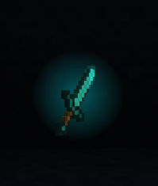
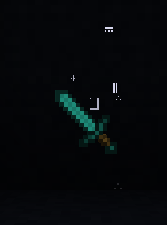

# Inventory Effects

## [Glow Outline Effect](src/main/java/brilliant_items/api/inventory_item_effects/builtin/GlowOutlineEffect.java)

> 
>
> Adds a glow outline by blurring the texture and placing it in the background

Structure:

- `identifier`: glow_outline
- Arguments:
    - `color`: `ARGB`, Hex color
    - `blurRadius`: `int`, The size of the pixels sampled for producing the blur
    - `sigma`: `float`, The size of the blur, higher value means bigger blur

Example:

```json lines
{
  "identifier": "glow_outline",
  "arguments": {
    "color": "FF00F6FF",
    "blurRadius": 2,
    "sigma": 1.2
  }
}
```

## [Radial Glow Effect](src/main/java/brilliant_items/api/inventory_item_effects/builtin/RadialGlowEffect.java)

> 
>
> Adds a radial glow behind the item

Structure:

- `identifier`: radial_glow
- Arguments:
    - `colors`: `List<ARGB>`, A list of colors which will be cycled through
    - `duration`: `ISO-8601 String`, The amount of time it takes to switch from one color to the next

Example:

```json lines
{
  "identifier": "radial_glow",
  "arguments": {
    "colors": [
      "FF00F6FF",
      "FFFFFFFF"
    ],
    "duration": "PT1S"
  }
}
```

## [Sparkle Effect](src/main/java/brilliant_items/api/inventory_item_effects/builtin/SparkleEffect.java)

> 
>
> Occasionally spawns particles resembling sparkles

Structure:

- `identifier`: sparkle
- Arguments:
    - `color`: `ARGB`, The color of the sparkle
    - `minLifetime`: `int`, The minimum lifetime of the particle in frames
    - `maxLifetime`: `int`, The maximum lifetime of the particle in frames
    - `velocity`: `{x: float, y: float}`, The velocity of the particle
    - `amountOfSparkles`: `int`, The number of particles which should be visible at once
    - `size`: `float`, The size of the particles
    - `texture`: `Resource Location`, The particle texture as a minecraft resource location

Example:

```json lines
{
  "identifier": "sparkle",
  "arguments": {
    "color": "FF00F6FF",
    "minLifetime": 800,
    "maxLifetime": 2000,
    "amountOfSparkles": 5,
    "size": 2.5,
    "texture": "brilliant_items:textures/particles/glow.png",
    "velocity": {
      "x": 5,
      "y": 5
    }
  }
}
```

# Entity Effects

## [Glow Pillar Effect](src/main/java/brilliant_items/api/entity_item_effects/builtin/GlowPillarEffect.java)

> 
>
> Adds a glowing `pillar` that marks the location of an item

Structure:

- `identifier`: glow_pillar
- Arguments:
    - `color`: `ARGB`, The color of the beam
    - `width`: `float`, The width of the beam in blocks
    - `height`: `float`, The height of the beam in blocks

Example:

```json lines
{
  "identifier": "glow_pillar",
  "arguments": {
    "color": "6600F6FF",
    "width": 0.3,
    "height": 1.5
  }
}
```

## [Pinwheel Effect](src/main/java/brilliant_items/api/entity_item_effects/builtin/PinwheelEffect.java)

> 
>
> Adds a rotating glowing `pinwheel` behind the item

Structure:

- `identifier`: pinwheel
- Arguments:
    - `color`: `ARGB`, The color of the pinwheel
    - `width`: `float`, The width of the pinwheel in blocks
    - `height`: `float`, The height of the pinwheel in blocks

Example:

```json lines
{
  "identifier": "pinwheel",
  "arguments": {
    "color": "6600F6FF",
    "width": 0.75,
    "height": 0.75
  }
}
```

## [Background Glow Effect](src/main/java/brilliant_items/api/entity_item_effects/builtin/BackgroundGlowEffect.java)

> 
>
> Very similar to the pinwheel effect, except with a radial glow texture

Structure:

- `identifier`: background_glow
- Arguments:
    - `color`: `ARGB`, The color of the glow
    - `width`: `float`, The width of the glow in blocks
    - `height`: `float`, The height of the glow in blocks

Example:

```json lines
{
  "identifier": "background_glow",
  "arguments": {
    "color": "6600F6FF",
    "width": 0.75,
    "height": 0.75
  }
}
```

## [Particle Spawning Effect](src/main/java/brilliant_items/api/entity_item_effects/builtin/ParticleSpawningEffect.java)

> 
>
> Occasionally spawns particles around the item

Structure:

- `identifier`: particle_spawner
- Arguments:
    - `particleId`: `int (required)`, The numerical id of the particle. Corresponds to its placement in the
      `EnumParticleTypes` enum
    - `rarity`: `int`, A 1 / x chance for a new particle to spawn every frame
    - `velocity`: `{x: float, y: float, z: float}`, The velocity of the particle **!WARNING! Changes functionality based
      on the type of particle (i.E it doesn't always equal the velocity)**
    - `maxAge`: `int`, The maximum age of the particle in frames
    - `color`: `ARGB`, The color of the particle
    - `offset`: `{x: float, y: float, z: float}`, An offset from the bottom center of the item. If not specified, a
      random offset is picked

Example:

```json lines
{
  "identifier": "particle_spawner",
  "arguments": {
    "particleId": 25,
    "rarity": 40,
    "velocity": {
      "x": 0,
      "y": 1,
      "z": 0
    },
    "maxAge": 20
  }
}
```

